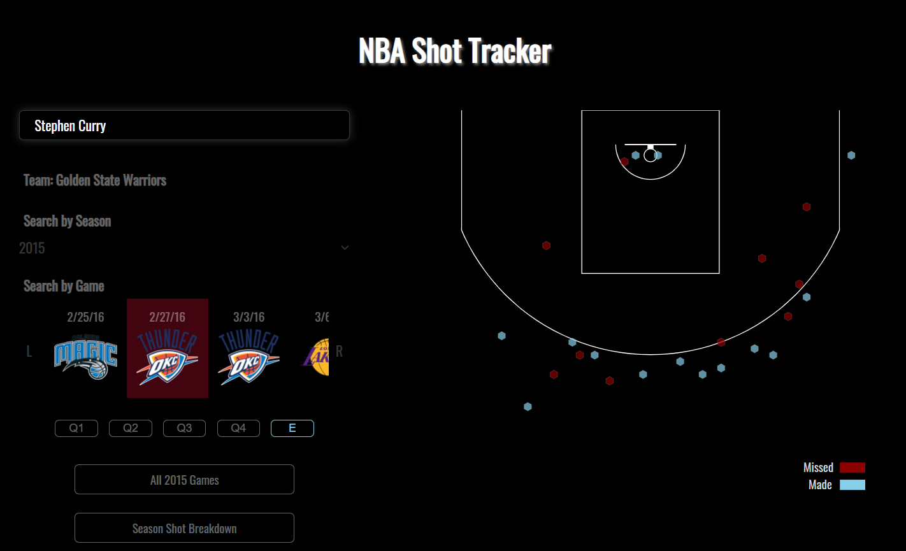

# NBA Shot Visualizer

## Rationale
I like basketball. So, I decided to try and visualize the areas on the court from which some of our favourite players were most dangerous (or not-so-dangerous). 

## Data 
All data (2000-2018) obtained from [this](https://nbasavant.com/shot_search.php) website. 

Please note: this is a project from a while ago, so the last season for which I have data is 2017-2018. Playoffs are also not included. That unfortunately does mean we can't visualize Playoff P's stats in the bubble. 

Sorry! 

## Features
See a player's shot performance for either individual games or for an entire season. If you select an individual game, you can filter by quarter. You'll notice the shots made/missed were placed in hexagonal bins. This was easier to account for overlapping x-y coordinates of shot locations, and also allowed me to account for frequencies of makes & misses.

Want a little more detail? Then, check out the FGM/FGA, shot type breakdown and shot distance stats. 

## Demo
Let's look at Russell Westbrook for the 2017-2018 season. 

We can also check out the season stats. 

Now let's look at an individual game - this time, we'll look at Stephen Curry. Specifically, we'll look at his game against the OKC Thunder on February 27th, 2016. 

## Stack
* Vanilla JS
* D3.js for graphing & binning
* R for CSV manipulation & sorting

